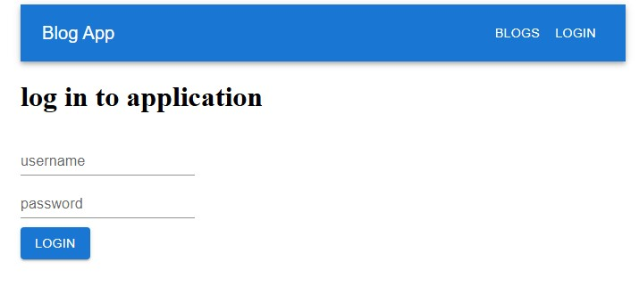
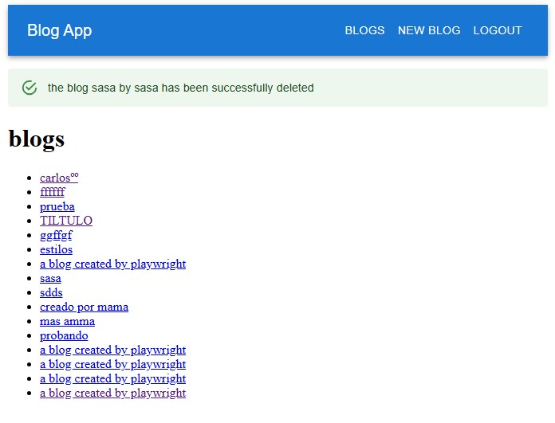
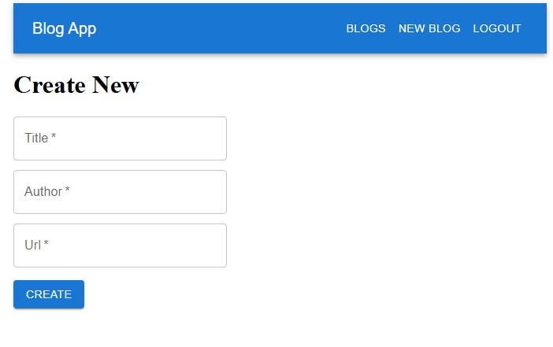

# Full Stack Open - Part 5 (Testing React apps & UI Frameworks)

A repository containing the solutions for Part 5 of the University of Helsinki course. It originally focuses on implementing tests, handling references, and authentication. However, this version of the repository was expanded to cover changes introduced in the course material on April 6, 2026, which moved the sections on React Router and UI frameworks from Part 7 to Part 5.

## 🛠️ Technologies
* **Frontend:** React + Vite, React Router
* **UI Library:** MaterialUI (MUI)
* **Testing:** Vitest, React Testing Library and Playwright (E2E)

## 📖 About
This repository is part of my learning journey in the Full Stack Open course. In this specific module, the work focuses on ensuring application reliability through automated testing and deepening my understanding of advanced React patterns for handling complex components. At the same time, user interface and user experience (UI/UX) principles were integrated to enhance the overall project presentation.

> [!NOTE]
> **Practice Project:** 🏛️ Exercises Project.
> This repository uses a simple folder structure: the `Practices` folder contains the example projects developed while reading the material, while the `Exercises` folder contains the projects used to complete the exercises for this level. The structure of both folders and the installation steps are identical.
> In the event that a single project is used for practices or to complete the exercises throughout the level, its respective folder will only contain that single project.

## 📸 Preview

### Login Screen


*Initial view where users must authenticate to access the bloglist.*

### Main Application


*Screenshot of the Bloglist application with the notification system.*



*Screenshot of the blog creation form.*

## 📋 Module Objectives / Key Features
* Login implementation and token handling (localStorage).
* Definition of propTypes for component validation.
* Unit tests for isolated components.
* Integration and E2E tests for complete user flows.
* Use of `forwardRef` and `useImperativeHandle`.
* Client-side routing implementation using React Router.
* UI/UX refactoring and component styling using Material UI.

## 🎓 Learning Outcomes
* Mastery of the JWT-based authentication flow and LocalStorage persistence.
* Ability to write tests that simulate real user interactions, reducing production errors.
* Improvement in component architecture through the use of advanced Hooks and type validation with PropTypes.
* Competence in managing single-page application (SPA) states and navigation links using React Router.
* Practical experience in accelerating frontend development by integrating and customizing predefined component systems via Material UI.
  
## ✅ Completed Exercises
* [x] 5.1 - 5.4: Bloglist frontend, steps 1-4
* [x] 5.5 - 5.12: Bloglist frontend, steps 5-12
* [x] 5.13 - 5.16: Bloglist tests, steps 1-4
* [x] 5.17 - 5.23: Bloglist end to end testing, steps 1-7
* [x] 5.24 - 5.28: Routed Blogs, steps 1-5
* [x] 5.29 - 5.31: Styled Blogs, steps 1-3

## 🧠 Overcome Challenges
* **Test Isolation:** Implementation of mocks for API services, ensuring that frontend tests do not depend on the backend state.
* **Stability in E2E Tests:** Handling waits and robust selectors in Playwright to avoid "flaky tests" during the authentication flow.
* **Component Encapsulation:** Correct use of `forwardRef` to expose functionalities of child components (such as collapsible forms) in a controlled manner.
* **Route Protection and Navigation:** Managing asynchronous user state to properly guard routes and handling smooth transitions with React Router without losing the authentication context.
* **UI Customization and Constraints:** Overcoming Material UI's default style nesting to adapt components seamlessly into the existing layout without breaking layout responsiveness.

## 📂 Project Structure
```text
.
├── Blog_app/                      # Main Project (Bloglist)
│   ├── frontend/                  # React + Vite Client
│   │   ├── src/                   # Components and UI logic
│   │   └── package.json
│   ├── backend/                   # Node.js / Express Server (API)
│   │   ├── controllers/           # Route logic
│   │   └── models/                # Database Schemas / Models
│   └── E2E-Test/                  # End-to-End Tests (Playwright)
├── Practices/                     # Follow-up material exercises
│   ├── Note_app/                  # Base application integrating React Router
│   ├── Note_app_UI_libraries/     # Interface refactor using Material UI (MUI)
│   └── Note_app_styled_components/ # Alternative styling using Styled Components
├── screenshots/                   # Screenshots for documentation
├── .gitignore                     # Git excluded files
└── README.md                      # General documentation
```

## 🚀 Installation
```bash
# Enter the Part 5 directory from the root of the repository
cd Part_05/Exercises/Blog_app

# Configure and start the Backend
cd backend
npm install
# Note: Create your .env file with MONGODB_URI and SECRET
npm run dev

# Open a new terminal and navigate to the frontend
cd ../frontend
npm install
npm run dev

# Run Unit/Integration Tests (Inside frontend folder)
npm run test

# Run E2E Tests (Navigate to E2E-Test folder from Blog_app root)
cd ../E2E-Test
npm install
npx playwright test
```

## 🧪 Testing Suite
This project implements a comprehensive testing strategy across the entire stack.

### 1. Frontend: Unit & Integration Tests
Powered by Vitest and React Testing Library.

```bash
cd Part_05/Exercises/Blog_app/frontend
npm run test
npm run coverage # For coverage report
```
### 2. Backend: Integration Tests
Verifies API endpoints and database logic using the native Node.js test runner and Supertest.

```bash
cd Part_05/Exercises/Blog_app/backend
npm run test
```

### 3. End-to-End (E2E) Tests
Utilizing Playwright for full user flow simulation, ensuring authentication and core features work seamlessly together.

> [!IMPORTANT]
> Prerequisites: The backend must be running in test mode (npm run start:test) and the frontend in dev mode (npm run dev) before executing E2E tests.

```bash
cd Part_05/Exercises/Blog_app/E2E-Test
npm run test        # Headless mode
npm run interfaz    # Interactive UI mode
```

## ⚙️ Environment Configuration
This project requires a MongoDB database and JWT secret.

1. Create a .env file in Part_05/Exercises/Blog_app/backend/.

2. Define variables:

```env
MONGODB_URI=your_mongodb_connection_string
TEST_MONGODB_URI=your_test_mongodb_connection_string
PORT=3003
SECRET=your_jwt_secret_phrase
```

> [!TIP]
> Using a separate TEST_MONGODB_URI is crucial. The test suite resets the database state before each execution to ensure reliability.

## 🔍 Project Notes
This repository strictly follows the University of Helsinki conventions, including the use of npm for dependency management and testing scripts. The primary focus is the transition toward Test-Driven Development (TDD) and improving frontend architecture.

---
**Carlos Puche** - Self-Taught Full Stack Developer.

[](https://www.linkedin.com/in/carlos-puche-0444b53ba/)
