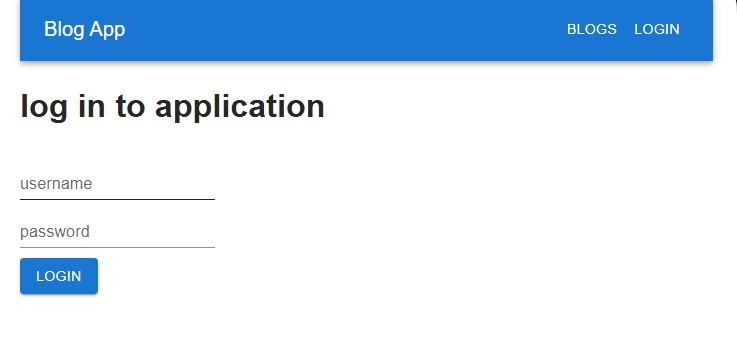
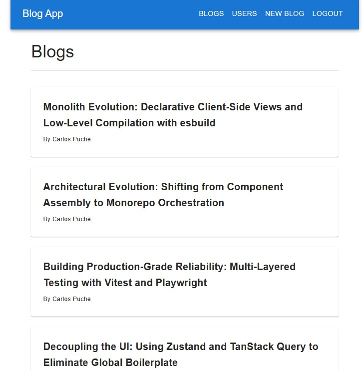
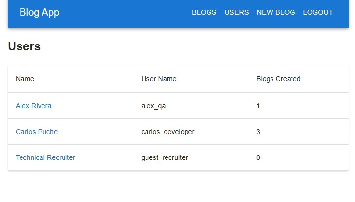
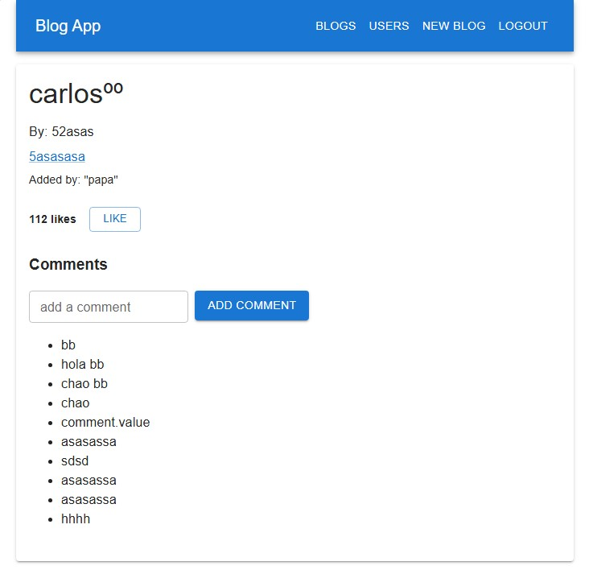
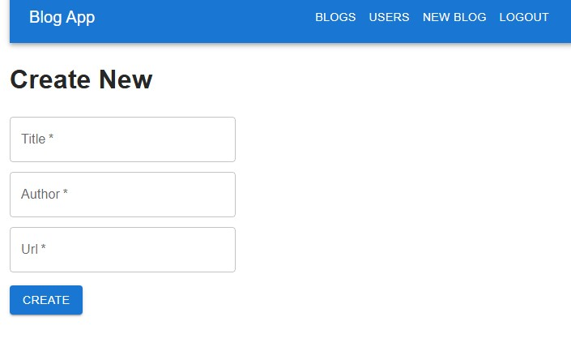
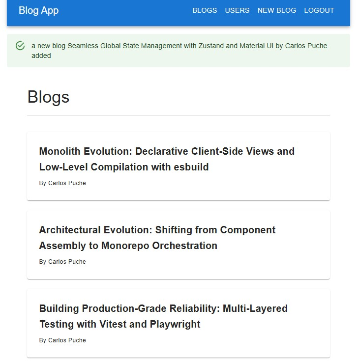

# Full Stack Open - Part 7 (Advanced Web Application Development)

A folder containing the solutions for Part 7 of the University of Helsinki course. This module transitions from isolated feature development to advanced frontend orchestration and tooling internals. The core work focuses on extending the Bloglist application by implementing client-side routing, advanced local state management, and unified development scripts, alongside standalone deep dives into bundling tools like esbuild.

## 🛠️ Technologies
* **Frontend State & Routing:** Zustand, React Router (`react-router-dom`)
* **UI Library:** Material UI (MUI) via Emotion
* **Backend:** Express, Mongoose, Bcrypt, JSON Web Tokens (JWT)
* **Testing Suite:** Vitest, React Testing Library, Playwright (E2E)
* **Tooling & DevOps:** Vite, esbuild, Concurrently, Axios, Cross-env

## 📖 About
This module represents the culmination of the core web development track. The exercises extend the core Bloglist application into a multi-view system, using client-side routing to manage specific user dashboards and individual blog interactions.

State management was refactored using Zustand to achieve cleaner component state separation without Context boilerplate. Beyond application logic, this folder documents foundational concepts in build automation, comparing mainstream bundlers like Vite with lower-level compilation via esbuild, and configuring parallel runtime workflows in development using Concurrently.

> [!NOTE]
> **Practice Project vs Exercises:**
> Following the repository layout, the `Practices` directory stores minimalist applications exploring single concepts (such as direct esbuild configurations or standard Axios consumers), while the `Exercises` directory holds the production-extended `Blog_app` which features full script orchestration.

## 🌐 Deployment & Live Demo

This is the final, production-ready version of the Blog Application, fully integrating Zustand for state management, Material UI for the interface, and React Router for client-side navigation.

* **⚡ Live Application:** [Explore the Blog App on Render](https://fullstack-open-blog-app-proyect.onrender.com)
* **🔑 Instant Guest Access:**
  - **Step 1:** Once the landing page loads, click on **"Login"** in the top navigation bar.
  - **Step 2:** In the login form, click the **"Login as Guest"** button (next to the submit button).
  - **Step 3:** You will be instantly authenticated to explore the full capabilities (create blogs, comment, leave likes, and safely delete your own posts).

> [!NOTE]
> ⏳ **Note on Cold Starts:** The live demo is hosted on Render's free tier. If the application has been idle, the container spins down and may take **50–60 seconds** to wake up on your first request. Thank you for your patience!

## 📸 Application Interface Gallery

### 1. Authentication Gate (Login)


*Initial Material UI login interface securing state contexts before routing initialization.*

### 2. Main Dashboard & Blogs View


*The centralized view displays active blogs, navigation layouts, and the interactive creation form toggler.*

### 3. User Analytics Dashboard


*A dedicated route (`/users`) rendered to track user activity metrics and total blog contributions across the platform.*

### 4. Granular Blog & Commenting System


*Parameterized dynamic view (`/blogs/:id`) displaying granular metadata alongside the asynchronous comment stream.*

### 5. Specialized Blog Creation Form


*A dedicated, clean tab focused exclusively on the blog creation workflow and data input.*

### 6. Dynamic Notification System


*Global Material UI feedback alert displaying real-time success confirmation, integrating with the app's notification context.*


## 📋 Module Objectives / Key Features
* Implementation of decentralized, lightweight state management with Zustand to manage session notification contexts and global app state.
* Integration of declarative client-side routing using React Router to separate views for explicit user metrics and granular blog views.
* Custom hook extraction (such as stateful form controllers with explicit lifecycle reset methods) to optimize business logic reuse.
* Deep-dive evaluation of compilation tooling internals, working directly with low-level bundlers like esbuild to understand compilation speed and asset generation.
* Automated workflow management using Concurrently to spin up unified development runtimes across multi-directory Full Stack environments.
* Production-ready deployment architecture through specialized asset pipeline compilation scripts (`vite build` coupled with automated asset cleanup and migration into Express target paths).

## 🎓 Learning Outcomes
* Advanced comprehension of monolithic application decomposition using client-side routing to structure dedicated multi-view single-page applications (SPAs).
* Competence in crafting highly cohesive, reusable React custom hooks, decoupling complex form state lifecycles and validation patterns from presentational components.
* Practical understanding of modern frontend build tool chains, differentiating high-level frameworks like Vite from lower-level build configurations with esbuild.
* Mastery of synchronized cross-directory development orchestration, abstracting complex backend/frontend execution boundaries under atomic npm scripts.
* Ability to design scalable build and distribution flows, ensuring automated client compilation and seamless asset synchronization inside server-side static paths.

## ✅ Completed Exercises

### Core Architecture & Custom Hooks
* [x] 7.1 - 7.3: Advanced Custom Hooks (`useField` state orchestration and object spread resolution).
* [x] 7.4 - 7.6: Routed Anecdotes (Implementing single-page navigation, notification timers, and custom form controls).
* [x] 7.7: Unified Stack Architecture (Frontend and backend orchestration).
* [x] 7.8: Application Resilience (Error boundary integration).
* [x] 7.9: Navigation Safeguards (Handling non-existing routes).
* [x] 7.10: Code Quality Automation (Automatic formatting pipeline).

### Application Expansion & State Unification (Zustand)
> [!NOTE]
> **Architectural Choice:** Following the course's flexible paths for exercises 7.11–7.14, I prioritized implementing the complete architecture using **Zustand** for global application state management to achieve a lightweight, scalable, and boilerplate-free solution.

* [x] 7.11 - 7.14: State Architecture Migration (Complete state refactoring via Zustand, steps 1-4).
* [x] 7.15: Code Decoupling & Refactoring.
* [x] 7.16 - 7.17: User Analytics Views (Global users dashboard and parameterized individual profile views).
* [x] 7.18 - 7.19: Interactive Features (Granular blog view and full asynchronous commenting system).
* [x] 7.20: UI Customization (Final responsive layout refactoring).

## 🧠 Overcome Challenges
* **Explicit Control in Custom Form Hooks:** Avoiding automated property bleeding into UI inputs by manually binding custom hook states (`value`, `onChange`) directly to Material UI fields, keeping the `reset` lifestyle method separate and under control.
* **State Decoupling & Boilerplate Elimination:** Migrating the expanded Bloglist application from native Context API/State patterns into centralized **Zustand** stores, achieving direct action-driven mutations while maintaining a predictable single source of truth.
* **Robust Route Protection & Parameter Tracking:** Handling asynchronous profile parameters and guarding unauthorized access across dynamic single-page application (SPA) views using React Router utilities.
* **Low-Level Build Bundling & Configuration:** Overcoming the abstraction layer of modern setups by configuring and executing direct builds via **esbuild** CLI, managing local minification and asset compilation manually.
* **Cross-Directory Asset Synchronization:** Designing automated build-and-migration pipeline scripts inside `package.json` to safely wipe legacy distributions (`rm -rf`) and pipe fresh production assets seamlessly across the frontend/backend divide.

## 📂 Project Structure

```text
📂 Part_07/
├── 📂 Exercises/
│   ├── 📂 Blog_app/                  # Unified multi-view blog application (Zustand + MUI)
│   │   ├── 📁 backend/               # Express REST API (Mongoose & User Authentication)
│   │   ├── 📁 frontend/              # Single-Page Application utilizing Material UI
│   │   ├── 📁 E2E-Test/              # End-to-End automated testing suite (Playwright)
│   │   ├── 📄 .prettierrc            # Opinionated code formatting blueprint
│   │   └── 📄 package.json           # Concurrently stack orchestration orchestrator
│   └── 📂 routed-anecdotes/          # Single-Page Application using React Router
│       ├── 📁 src/                   # Custom hooks (useField) & navigation logic
│       ├── 📄 db.json                # Local JSON-Server mock database
│       └── 📄 package.json           # Client and mock-server runtimes configuration
├── 📂 Practices/
│   ├── 📂 classComponents/           # Exploration of legacy React class-based architectures
│   ├── 📂 customHooks/               # Sandbox for decoupled reusable logic isolation
│   ├── 📂 internalEsbuild/           # Low-level compilation using pure esbuild bundles
│   ├── 📂 useCallback/               # Performance optimization testing via useCallback
│   ├── 📂 useMemo/                   # Heavy computational caching tests via useMemo
│   └── 📁 node_modules/              # Automated local json-server dependency cache
├── 📂 Screenshots/                   # Visual documentation of multi-view UI layouts
└── README.md

```

## 🚀 Installation
```bash
# Enter the Part 7 directory from the root of the repository
cd Part_07/Exercises/Blog_app

# Configure and start the Backend
cd backend
npm install
# Note: Create your .env file with MONGODB_URI and SECRET (see Environment Configuration below)
npm run dev

# Open a new terminal and navigate to the frontend
cd ../frontend
npm install
npm run dev

# Open a third terminal to configure the End-to-End test suite
cd ../E2E-Test
npm install
```

## 🧪 Testing Suite
This project implements a comprehensive testing strategy across the entire stack.

### 1. Frontend: Unit & Integration Tests
Powered by Vitest and React Testing Library to verify UI components, form tracking, and notification actions.

```bash
cd Part_07/Exercises/Blog_app/frontend
npm run test
npm run coverage   # Generates local Vitest coverage reports
```
### 2. Backend: Integration Tests
Verifies API endpoints and database logic using the native Node.js test runner and Supertest.

```bash
cd Part_07/Exercises/Blog_app/backend
npm run test
```

### 3. End-to-End (E2E) Tests
Utilizing Playwright for full multi-view user flow simulation, verifying route access restrictions, and blog generation.

> [!TIP]
> **Automated Environment Setup:** Thanks to a custom `webServer` configuration inside Playwright, executing the test commands below will automatically spin up the backend (in test mode) and the frontend (in dev mode) simultaneously. You no longer need to start the servers manually in separate terminals!

```bash
cd Part_07/Exercises/Blog_app/E2E-Test
npm install
npm run test        # Executes tests in headless mode
npm run interfaz    # Launches the interactive Playwright UI runner
```

## ⚙️ Environment Configuration
The Express backend requires an active MongoDB database cluster and a specialized cryptographic signature for JSON Web Tokens (JWT).

1. Create a `.env` file in Part_07/Exercises/Blog_app/backend/.
2. Define the target environmental fields:

```env
MONGODB_URI=your_mongodb_connection_string
TEST_MONGODB_URI=your_test_mongodb_connection_string
PORT=3003
SECRET=your_jwt_secret_phrase
```

> [!TIP]
> Using a separate TEST_MONGODB_URI is crucial. The test suite resets the database state before each execution to ensure reliability.

## 🔍 Project Notes
This repository follows the University of Helsinki's strict curriculum standards, utilizing decentralized frontend configurations and specialized script workflows. The core focus of this module shifted from basic application flows to full architectural orchestration: mastering client-side single-page routing (React Router), migrating monoliths into lightweight action-driven global stores (Zustand), and evaluating low-level compilation pipelines using custom esbuild setups.

---
**Carlos Puche** - Self-Taught Full Stack Developer.

[](https://www.linkedin.com/in/carlos-puche-0444b53ba/)
